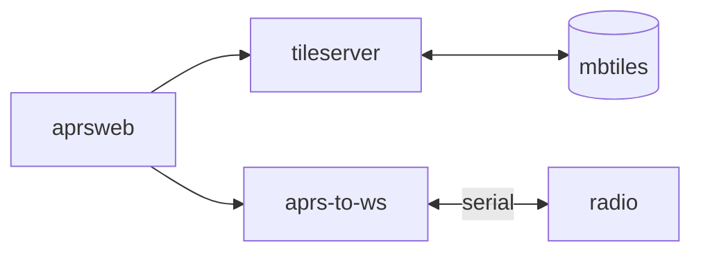

# APRS viewer

When connected to a radio, these containers show APRS reports on a map.

## Getting started

1. Download tiles from [MapTiler](https://data.maptiler.com/downloads/tileset/osm/north-america/us/?usage=non-commercial) or create your own.
2. Update `docker-compose.yaml` to specify tile location and radio
3. `docker compose up`

## Architecture




## Web server configuration

Nginx can be used for SSL termination and reverse proxy.

In `/etc/nginx/conf.d/upstreams.conf`, create something like:

```conf
upstream aprs-to-ws {
    server 127.0.0.1:13254;
}

upstream tileserver {
    server 127.0.0.1:13255;
}

upstream aprsweb {
    server 127.0.0.1:13256;
}
```

In `/etc/nginx/sites-available/aprs`, create something like:

```conf
location /aprs {
    rewrite ^/aprs(.*) /$1 break;       
    proxy_pass http://aprsweb;
}
location /aprs/ws {
    proxy_pass http://aprs-to-ws;
    proxy_http_version 1.1;
    proxy_set_header Upgrad $http_upgrade;                                          
    proxy_set_header Connection "Upgrade"; 
}

location ~ ^/aprs/tiles/.* {
    rewrite ^/aprs/tiles/(.*) /$1 break;
    proxy_pass http://tileserver;
}

```