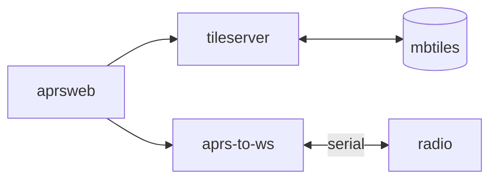

# APRS viewer

When connected to a radio, these containers show APRS reports on a map.

## Getting started

1. Download tiles from [MapTiler](https://data.maptiler.com/downloads/tileset/osm/north-america/us/?usage=non-commercial) or create your own.
2. Update `docker-compose.yaml` to specify tile location and radio
3. `docker compose up`

## Architecture

